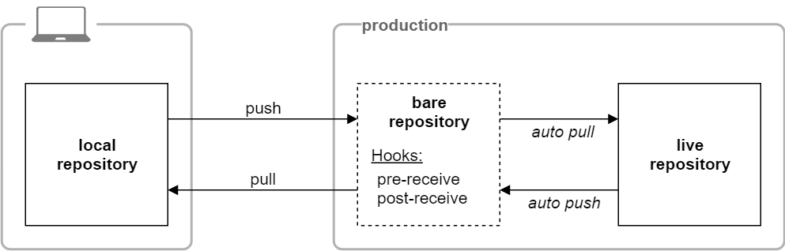
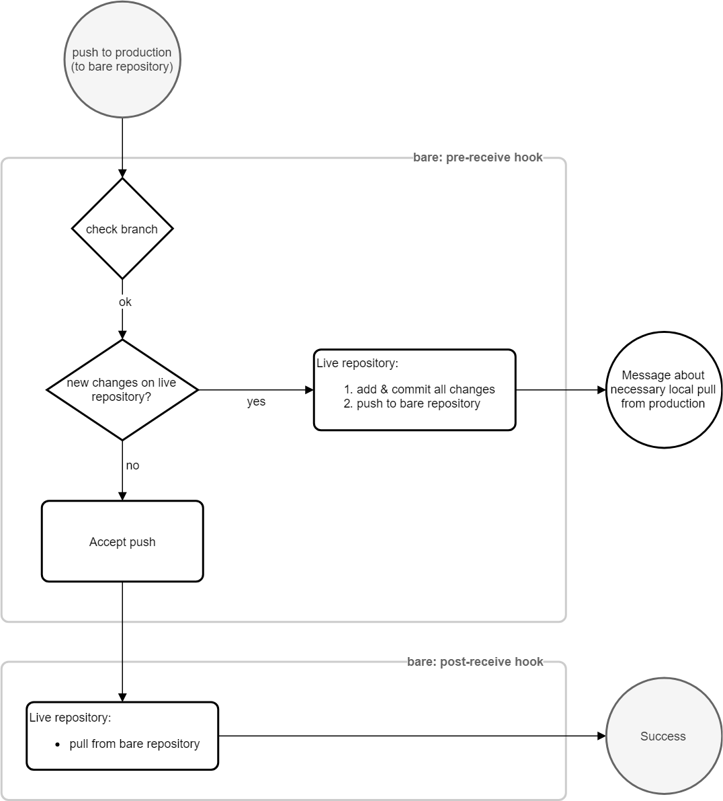

# Automated git push deployment

Method and scripts to deploy to a remote repository which can also be directly modified.

## Why?

Many methods using a git bare repository exist and allow deployments through `git push`, but they fall short when the remote content must also be modified by other means.

Such a situation should not arise in a traditional development environment. Nevertheless, there are cases where it does. There are even cases where the software itself is designed in this way. Flat file CMS are such an instance.

## How it works?

The remote - let us call it _production_ - has two repositories:

- **bare**  
   special repository that allows us to push to it
- **live**  
   live application repository with the actual files (worktree)

To deploy from a local repository:

1. We push to _production_, more precisely to `bare`.
2. The hooks on `bare` check the state of `live`:
    - if there are modifications, they are pushed to `bare`;
    - if there are no modifications, our push is accepted and `live` pulls from `bare`.

### Map

### Process flow

## Prerequisites

- git installed locally
- git installed on remote
- access to the remote through SSH for deployments with `git push`

## Setup

### 1. Production

1. Create the `bare` repository:

       git init --bare bare.git

2. Copy the content of [bare.git](bare.git) to the newly created directory.
3. Add execution permissions:

       chmod +x deploy-config.sh
       chmod +x hooks/pre-receive
       chmod +x hooks/post-receive

1. Create the `live` repository where your application should be located:

       git init

2. In `live`, add `bare` to remotes: 

       git remote add bare /path/to/bare.git

1. Edit `deploy-config.sh` according to your setup.

### 2. Local

1. If no local repository exists, create one:

       git init

2. Add _production_ to remotes, more precisely its `bare` repository:

       git remote add production user@yourserver:/path/to/bare.git

## Usage

When everything above is set up, and provided that an SSH connection can be established with the remote server, we can deploy from the local repository with:

       git push production master

## Pull from `live` without pushing

Directly pulling from `live` is impossible, as git does not have any fetch or pull hook.

If you absolutely need to pull from `live` without pushing any commit, there is a method that only works if changes were made to _production_ since the last commit (otherwise your dummy commit will be register on _production_):

1. make a dummy commit (`touch dummy`);
2. push it to _production_;
3. if as expected new work was made on `live`, the push is rejected and both _production_ repositories get synchronized;
4. cancel the dummy commit (`git reset HEAD~1 ; git clean -f`) 
5. pull from remote

## Notes

- There are no cron jobs involved.
- For a `push` to be accepted, `bare` and `live` must be synchronized.
- `bare` and `live` are automatically synchronized on each `push` trial.
- You cannot directly pull new work from `live` (see: [Pull from `live` without pushing](#pull-from-live-without-pushing));
- This setup is not a replacement for a backup system.